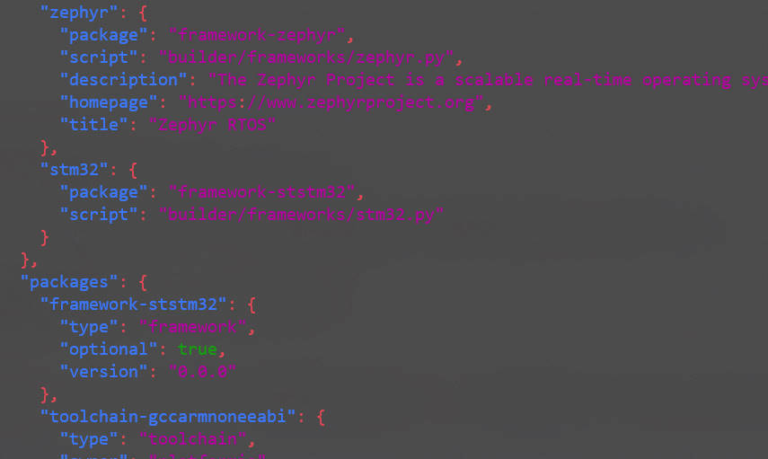
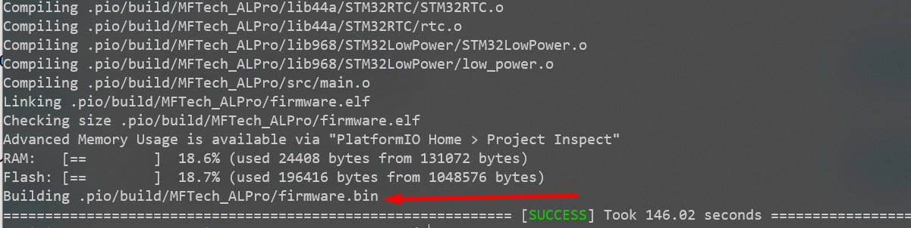

## Сборка проекта mftech-f405

3. Устанавливаем компоненты [Platformio](https://platformio.org/)
    ``` bash
    pio pkg install -g --platform "platformio/ststm32@^15.4.1"
    ```

4. Копируем собственную реализацию [Arduino_Core_STM32](https://github.com/stm32duino/Arduino_Core_STM32) (коммит fe500808f773c00f537ba3242ed18e0bdc5008f9)
    ``` bash
    cp -r ~/airlogic/src/framework-ststm32 ~/.platformio/packages/
    ```

5. Добавить в файл `~/.platformio/platforms/ststm32/platform.json` конфигурацию для использования нашего фреймворка для сборки проекта
    * В секцию `frameworks`:
      ``` json
      "stm32": {
        "package": "framework-ststm32",
        "script": "builder/frameworks/stm32.py"
      }
      ```

    * В секцию `packages`:
      ``` json
      "framework-ststm32": {
        "type": "framework",
        "optional": true,
        "version": "0.0.0"
      }
      ```
    

6. Добавляем сборочный скрипт для сборки через наш фреймворк
    ``` bash
    cp ~/.platformio/packages/framework-ststm32/tools/platformio-build.py ~/.platformio/platforms/ststm32/builder/frameworks/stm32.py
    ```

7. Добавляем конфигурацию для плат в проект
    ``` bash 
    mkdir ~/airlogic/src2/mftech-f405/boards 
    cp ~/airlogic/src/mftech_alpro10.json ~/airlogic/src2/mftech-f405/boards
    ```


8. Отредактировать файл фреймворка `~/.platformio/packages/framework-ststm32/package.json` следующим образом:
    ``` json
    {
        "name": "framework-ststm32",
        "description": "Wiring-based Framework (STM32 Core)",
        "version": "0.0.0"
    }
    ```

9. Отредактировать файл `~/airlogic/src2/mftech-f405/platformio.ini` конфигурации сборки проекта mftech-f405 следующим образом:
    ``` ini
    platform_packages =
        toolchain-gccarmnoneeabi@1.90201.191206
        framework-ststm32@0.0.0
    ```

10. Исправление ошибок проекта:
    * В файле `~/.platformio/packages/framework-ststm32/variants/MFTECH_ALPRO/PeripheralPins.c` заменить Arduino.h на sketch.h
    * В файле `~/.platformio/packages/framework-ststm32/variants/MFTECH_ALPRO/variant.cpp` заменить pins_arduino.h на pins_stm.h
    * Скопировать недостающую библиотеку `cp -r ~/airlogic/src2/flasher/lib/CircularBuffer ~/airlogic/src2/mftech-f405/lib/`
    * В файле `~/airlogic/src2/mftech-f405/lib/mfproto/mfmeasure.h` заменить `SpdTIM.setMode(channel, TIMER_INPUT_CAPTURE_FALLING, pin, 0xF);` на `SpdTIM.setMode(channel, TIMER_INPUT_CAPTURE_FALLING, pin);`
    * В файле `~/airlogic/src2/mftech-f405/src/main.cpp` на строке 1408 закомментировать `,`
    * Удалить дублирующие файлы `rm -rf ~/.platformio/packages/framework-ststm32/libraries/SrcWrapper/src/stm32/rtc.c ~/.platformio/packages/framework-ststm32/libraries/SrcWrapper/src/stm32/low_power.c`

11. Произвести сборку проекта mftech-f405
    ``` bash
    cd  ~/airlogic/src2/mftech-f405
    pio run
    ```

    

## Сборка mf_lcd

Все предыдущие шаги и:

1. Добавляем конфигурацию для плат в проект
    ``` bash 
    mkdir ~/airlogic/src2/mf_lcd/boards 
    cp ~/airlogic/src/mftech_alpro10_lcd.json ~/airlogic/src2/mf_lcd/boards
    ``` 
2. Отредактировать файл `~/airlogic/src2/mf_lcd/platformio.ini` конфигурации сборки проекта mf_lcd следующим образом:
    ``` ini
    platform_packages =
        toolchain-gccarmnoneeabi@1.90201.191206
        framework-ststm32@0.0.0
    ```

3. Исправление ошибок проекта:
    * Заменить `~/.platformio/packages/framework-ststm32/variants/MFTECH_LCD/PeripheralPins.c` заменить Arduino.h на sketch.h
    * Заменить `~/.platformio/packages/framework-ststm32/variants/MFTECH_LCD/variant.cpp` заменить pins_arduino.h на pins_stm.h
    * Скопировать недостающую библиотеку `cp -r ~/airlogic/src2/flasher/lib/CircularBuffer ~/airlogic/src2/mf_lcd/lib/`

## Сборка button

Все предыдущие шаги и:

1. Добавляем конфигурацию для плат в проект
    ``` bash 
    mkdir ~/airlogic/src2/button/boards 
    cp ~/airlogic/src/test_f051.json ~/airlogic/src2/button/boards
    ``` 
2. Отредактировать файл `~/airlogic/src2/button/platformio.ini` конфигурации сборки проекта button следующим образом:
    ``` ini
    platform_packages =
        toolchain-gccarmnoneeabi@1.90201.191206
        framework-ststm32@0.0.0
    ```

3. Исправление ошибок проекта:
    * Заменить `~/.platformio/packages/framework-ststm32/variants/MFTECH_BUTTON/PeripheralPins.c` заменить Arduino.h на sketch.h
    * Заменить `~/.platformio/packages/framework-ststm32/variants/MFTECH_BUTTON/variant.cpp` заменить pins_arduino.h на pins_stm.h

## Сборка bootloader

Все предыдущие шаги и:

1. Добавляем конфигурацию для плат в проект
    ``` bash 
    mkdir ~/airlogic/src2/bootloader/boards 
    cp ~/airlogic/src/mftech_alpro10.json ~/airlogic/src2/bootloader/boards
    ``` 
2. Отредактировать файл `~/airlogic/src2/bootloader/platformio.ini` конфигурации сборки проекта bootloader следующим образом:
    ``` ini
    platform_packages =
        toolchain-gccarmnoneeabi@1.90201.191206
        framework-ststm32@0.0.0
    ```

3. Исправление ошибок проекта:
    * Скопировать недостающую библиотеку `cp -r ~/airlogic/src2/flasher/lib/CircularBuffer ~/airlogic/src2/bootloader/lib/`
    * Скопировать недостающую библиотеку `cp -r ~/airlogic/src/mfproto/lib/Crypto ~/airlogic/src2/bootloader/lib/`

## Сборка bootloader_f051

Все предыдущие шаги и:

1. Добавляем конфигурацию для плат в проект
    ``` bash 
    mkdir ~/airlogic/src2/bootloader_f051/boards 
    cp ~/airlogic/src/test_f051.json ~/airlogic/src2/bootloader_f051/boards
    ``` 
2. Отредактировать файл `~/airlogic/src2/bootloader_f051/platformio.ini` конфигурации сборки проекта bootloader_f051 следующим образом:
    ``` ini
    platform_packages =
        toolchain-gccarmnoneeabi@1.90201.191206
        framework-ststm32@0.0.0
    ```

3. Исправление ошибок проекта:
    * Скопировать недостающую библиотеку `cp -r ~/airlogic/src2/flasher/lib/CircularBuffer ~/airlogic/src2/bootloader_f051/lib/`
    * Скопировать недостающую библиотеку `cp -r ~/airlogic/src/mfproto/lib/Crypto ~/airlogic/src2/bootloader_f051/lib/`

## Сборка flasher

Проект собирается только под Linux!

Все предыдущие шаги и:

1. Исправление ошибок проекта:
    * Скопировать недостающую библиотеку `cp -r ~/airlogic/src/mfproto/lib/Crypto ~/airlogic/src2/flasher/lib/`